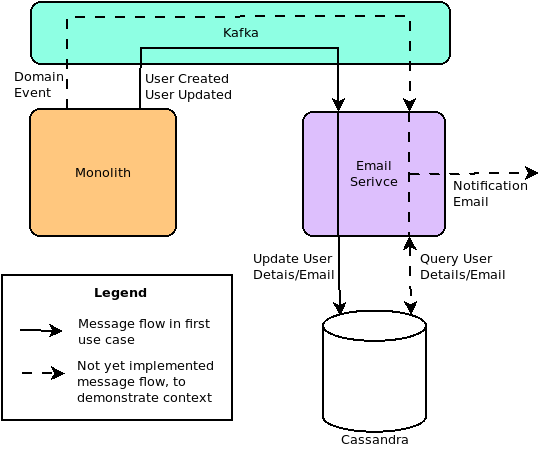

# MicroProfile Streams

This proposal, in its current state, explores the question "what if Java offered a new API for handling streams of messages (either point to point or from a message broker) based on the JDK9 Flow API that was lighter weight and easier to use than JMS/MDBs".

To start, we identify one very simple use case, we provide the absolute minimum API necessary to implement that use case, we implement that use case on top of that API, and then we provide an absolute minimum implementation of that API to demonstrate it in action. Subsequent iterations of this proposal can add to the API, but the aim for now is to provide a starting point for discussion and understanding.

Note that the JDK9 Flow API of course requires a baseline requirement of JDK9 for MicroProfile. It may be found that by the time this spec is ready for inclusion in MicroProfile, that MicroProfile is not ready to increase its baseline JDK version to 9. In that case, the JDK9 Flow API can be replaced with the JDK8 compatible Reactive Streams API provided by http://www.reactive-streams.org, which is semantically identical to the JDK9 Flow API, the interfaces just live in a different package. So this proposal will talk about the JDK9 Flow API, as that's the long term target, but it may end up proposing something based on the JDK8 Reactive Streams interfaces. In the design of the API, this switch, and potential simultaneous compatibility for both by implementors, should be considered.

## Use case

Email notification service.

A monolith is being decomposed into multiple microservices, and the first service that has been extracted is the email notification service. The basic function of the email notification service is to take raw domain events - published to a message broker, and convert them to email notifications, sent to the user associated with the domain event.

The domain events identify the user associated with the event by id, they do not have the users email address or name, hence, to render the notifications and direct the email, the email service needs to be able to look up a users email address and name given their ID. One of the principles being closely adhered to in this system that microservices should be decoupled - an outage or performance problem in one service should not, as much as possible, impact the availability or performance of other services. Hence the the email notification service should not lookup the user details from another service, as this would couple the email service to that service, rather it should keep its own local store of user details in order to function autonomously.

To facilitate this, the system has been written to publish all user created and updated events to a message broker topic. The email service is then able to subscribe to this topic, and maintain a user id to to name and email address mapping in its own database, which it can then query in order to render and send email notifications to system events that it receives.

The single use case that we will implement first is subscribing to this topic, and processing the messages by persisting the updated user details in a database. Subsequent use cases implemented will include subscribing to the actual domain events and publishing emails, implementing group subscriptions, handling notification preferences, etc.

## Technology choices

A number of technology choices need to be made to implement the use case. These technology choices are for implementing the use case, they are not for the API proposal itself.

### Message broker

The message broker will of course be abstracted over - this is the whole point of this proposal, however for demonstration of the API in action, one does need to be selected. Any message broker that supports pubsub could be used. Arguably the most popular message broker for microservices deployments is Apache Kafka. There also exists a number of Reactive Streams based implementations of Apache Kafka clients, making it a very straight forward choice to use. Hence, we will use Apache Kafka.

### Database

Literally any database could be used. Because we want to demonstrate an asynchronous streaming library, a database that has an asynchronous Java connector is preferred. Additionally, a database that provides that asynchronous support using standard JDK interfaces such as `CompletionStage` will be more practical, particularly in light of the current Asynchronous DataBase Adapter effort, which uses `CompletionStage`. Apache Cassandra with the experimental version 4.0 Java driver has been selected, as it provides a `CompletionStage` based API.

### Reactive Streams

While the API will be based on the JDK9 Flow API, this is an integration SPI. An additional library is required to manipulate JDK9 Flow based streams. It is hoped that a future JDK version [will provide such a library](http://mail.openjdk.java.net/pipermail/core-libs-dev/2018-February/051662.html). But in the meantime, a third party streaming library needs to be selected - candidates include Akka Streams, Spring Reactor and RxJava. As the author of this proposal prefers (and works for the company behind) Akka Streams, so that has been selected, but switching to a Reactor or RxJava based solution should be somewhat trivial.

## Use case design

This diagram shows both the initial use case, and an intended future use case to be implemented. In this first iteration, only the first use case will be implemented.

## Code

### API

Two classes are defined for the API - an [`@Ingest`](microprofile-streams-api/src/main/java/org/eclipse/microprofile/streams/Ingest.java)
annotation for annotating methods that supply a `java.util.concurrent.Flow.Subscriber` to subscribe to a message broker, and an [`Envelope`](microprofile-streams-api/src/main/java/org/eclipse/microprofile/streams/Envelope.java) interface that wraps messages, and provides a `commit` message to indicate that the message has been handled.

### Implementation

The implementation is implemented as a CDI extension, which scans for `@Ingest` annotated methods, and wraps the injection target for beans that define such a method to ensure that the subscription to the message broker starts up and shuts down when the bean is started and destroyed respectively. So, the lifecycle of the subscription is bound to the lifecycle of the bean, meaning we could for example have session scoped beans that only received events while the session was active.

It uses Akka for running the streams, and uses reactive Kafka (an Akka based reactive streams adapter for the Kafka client) to connect to Kafka. It's using Akka's back off supervisor support to ensure subscriptions stay active after failure, using an exponential backoff to protect resources from being hammered in a tight loop.

The CDI extension is defined [`here`](microprofile-streams-impl/src/main/java/org/eclipse/microprofile/streams/impl/AkkaKafkaStreamsCdiExtension.java). The code that sets up the Akka streams and connection to Kafka is [`here`](microprofile-streams-impl/src/main/java/org/eclipse/microprofile/streams/impl/AkkaKafkaStreamsCdiExtension.java).

### Example use case

The example use case code implements the use case described above. The subscribing bean is defined [`here`](microprofile-streams-example/src/main/java/org/eclipse/microprofile/streams/example/UserDetailsSubscriber.java).

To run the use case, you'll need the following:

1. Kafka installed and running on port 9092 (along with Zookeeper).
2. Cassandra installed and running on port 9042, with the following keyspace/table created:

        create keyspace streaming with replication = {'class':'SimpleStrategy', 'replication_factor':1};
        create table streaming.user_details (id uuid primary key, name text, email text);

3. Run the example by executing the following:

        mvn clean install
        mvn -pl microprofile-streams-example exec:java -Dexec.mainClass="org.eclipse.microprofile.streams.example.Main"

4. Test by using kafkacat to put a message on the queue:

        echo '{"type": "CREATED", "id": "6b46e75c-2e1e-4a91-b7a0-ff785c305a81", "name": "John Smith", "email": "john@example.com"}' | kafkacat -P -b localhost:9092 -t user-details.events

5. Check that messages are being correctly handled by checking the cassandra table:

        select * from streaming.user_details;
